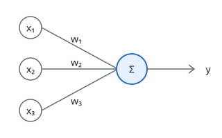
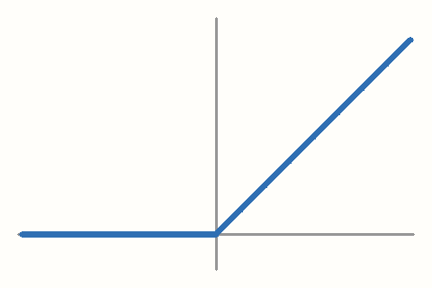

:::lede
这一页按内容格式文档的顺序，使用 bake 支持的每一种写法。
:::

## 反向传播中的链式法则 {#chain-rule toc=链式法则}

::subtitle[从标量推广到矩阵]

梯度指向函数值==增长最快==的方向。中文==重点：==后面紧跟标点也能识别。

中文**加粗：**后面，**「引号」**测试，以及~~删除线~~。

> You shall know a word by the company it keeps.
>
> ::source[J. R. Firth, 1957]

## 图片 {#images}

{width=60%}

{width=160px float=left}

一个神经元把每个输入乘以对应的权重，求和后加上偏置，再经过激活函数得到输出。多个神经元并排组成一层，多层依次连接组成网络。

{width=240 float=right}

ReLU 在负半轴输出 0，在正半轴输出输入本身。它的导数在负半轴是 0，在正半轴是 1，计算量很小，所以是深度网络里最常用的激活函数。

## 组件 {#components}

:::demo-plot{x0=1.2}
从 $x_0$ 出发沿负梯度方向下降。
:::

::demo-plot{x0=0.5 showPath=false}

## 块 {#blocks}

:::fold[推导细节]
把 $z = Wx + b$ 代入后逐项求导。
:::

:::callout
本文的向量都是列向量。
:::

:::callout
先看图再看公式。
:::

:::callout[求和次序]
这里的求和不能交换次序。
:::

正文段落。

:::wide
| 函数 | 定义 | 导数 |
| - | - | - |
| ReLU | $\max(0, x)$ | $\mathbb{1}[x > 0]$ |
:::

softmax 把任意实数向量变成概率分布。

:::margin
名字来自 argmax 的平滑版本。
:::

## 旁注 {#sidenotes}

反向传播从损失函数开始，沿计算图逆向逐层计算梯度。

每一层的梯度都由上一层传回的梯度乘以本层的局部导数得到[^d]。局部导数只依赖本层的输入和输出，所以每一层可以独立计算，再按顺序连乘起来。

[^d]: 局部导数是本层输出对本层输入的导数 $\partial y / \partial x$。

    注释可以有多段，后面的段落缩进四个空格。

:span[激活函数的导数][^act]决定了梯度能否顺利传回前面的层。

[^act]: ReLU 在正半轴的导数是 1。

最后得到的是损失对每个参数的梯度。优化器用这些梯度更新参数，进入下一轮前向传播。

## 卡片网格 {#bento}

::::bento
:::card{span=2x1 title=ReLU}
最简单的激活函数。
:::

:::card{title=GELU}
平滑。
:::

:::card{title=SiLU}
自门控。
:::

:::card{span=4x1 title=比较}
三者在零点附近的导数不同。
:::
::::

## 表格与 HTML {#table}

| 函数 | 零点处导数 |
| - | -: |
| ReLU | 不存在 |
| GELU | 0.5 |
| SiLU | 0.5 |

<svg viewBox="0 0 120 40" width="240" fill="none" stroke="currentColor">
  <rect x="4" y="8" width="40" height="24" rx="4"/>
  <rect x="76" y="8" width="40" height="24" rx="4"/>
  <path d="M44 20 H76"/>
</svg>

## 公式 {#math}

行内公式 $E = mc^2$ 写在段落里。

$$
\label{eq:chain}
\frac{\partial L}{\partial x} = \frac{\partial L}{\partial y} \frac{\partial y}{\partial x}
$$

式 $\eqref{eq:chain}$ 是链式法则。

### 配置文件中的宏

$\R$ 是 `bake.config.js` 的 `math.macros` 定义的宏，输入向量 $x \in \R^n$。

## 站内引用 {#links}

这里用到的是[链式法则](/features#chain-rule)。

链式法则把复合函数的导数写成各层导数的乘积。 ^chain-rule-def

[上面这一段](#chain-rule-def)是链式法则的定义。梯度下降的完整推导见[用梯度下降求函数的最小值](/paper)，其中[步长的选择](/paper#step-size)给出了迭代发散的条件。交互图的写法见[组件](#components)一节。

## 列表与代码 {#lists}

- 第一项
- 第二项，带 *强调* 和 **加粗**
  - 嵌套项

1. 第一步
2. 第二步
3. 第三步

- [x] 已完成的任务
- [ ] 未完成的任务

```js
export const answer = 42;
```

第一行末尾是硬换行\
第二行。

---

:::references
- Rumelhart, Hinton, Williams. Learning representations by back-propagating errors. 1986.
- Hendrycks, Gimpel. Gaussian Error Linear Units. 2016.
:::
